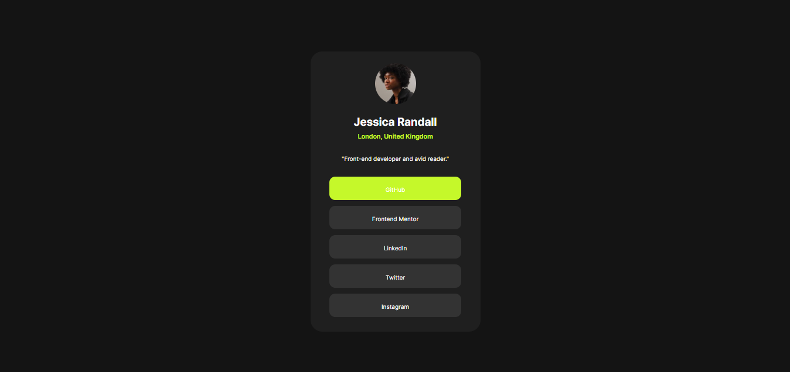

# Frontend Mentor - Social links profile solution

This is a solution to the [Social links profile challenge on Frontend Mentor](https://www.frontendmentor.io/challenges/social-links-profile-UG32l9m6dQ). Frontend Mentor challenges help you improve your coding skills by building realistic projects. 

## Table of contents

- [Overview](#overview)
  - [The challenge](#the-challenge)
  - [Screenshot](#screenshot)
  - [Links](#links)
- [My process](#my-process)
  - [Built with](#built-with)
- [Author](#author)

## Overview

### The challenge

Users should be able to:

- See hover and focus states for all interactive elements on the page

### Screenshot

](./screenshot.jpg)

### Links

- Solution URL: [Link](https://github.com/MrUnAnonymous/social-links-solution)
- Live Site URL: [Link](https://your-live-site-url.com)

## My process

- Built a card and centerd it with CSS.
- Added image and styled according to the given requriement.
- Added the title, location and description and styled it.
- Added the link titles in a div and added color change on hover.

### Built with

- Semantic HTML5 markup
- CSS custom properties
- Flexbox

## Author

- Frontend Mentor - [Saurabh-Sapkal](https://www.frontendmentor.io/profile/MrUnAnonymous)
